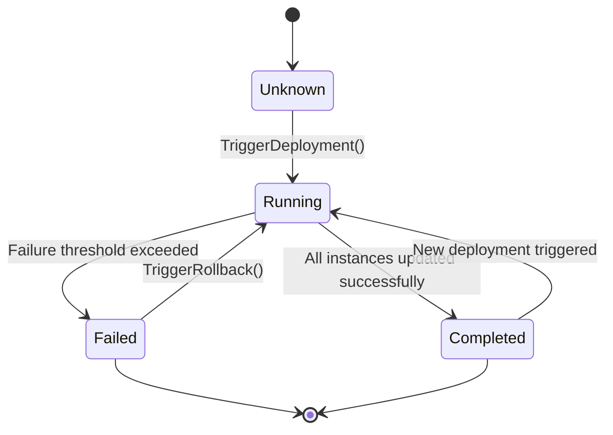
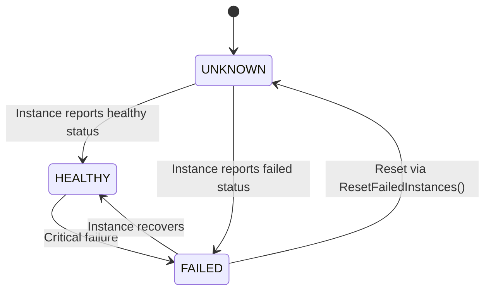
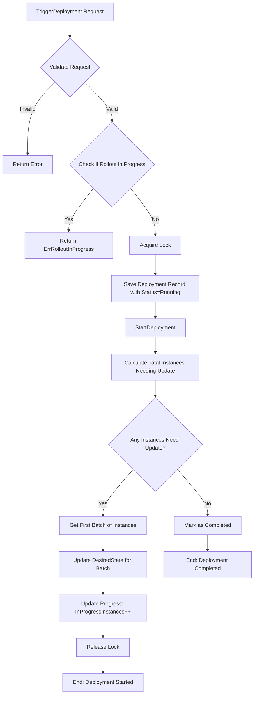
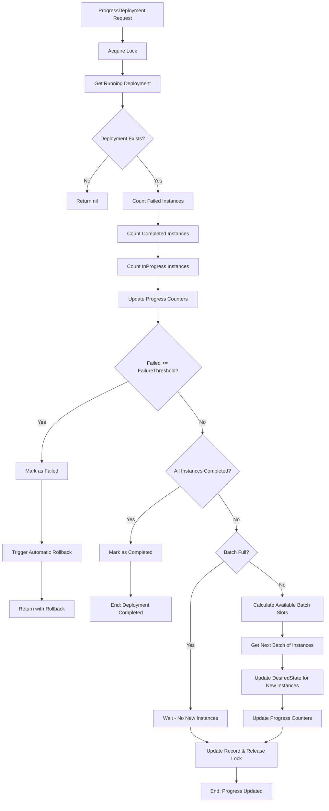
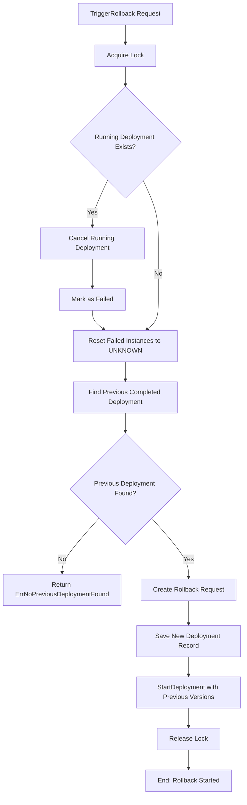
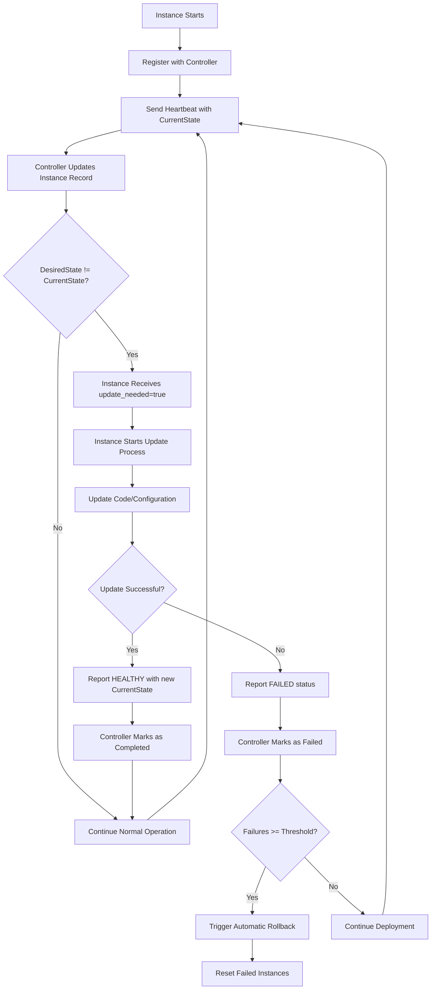
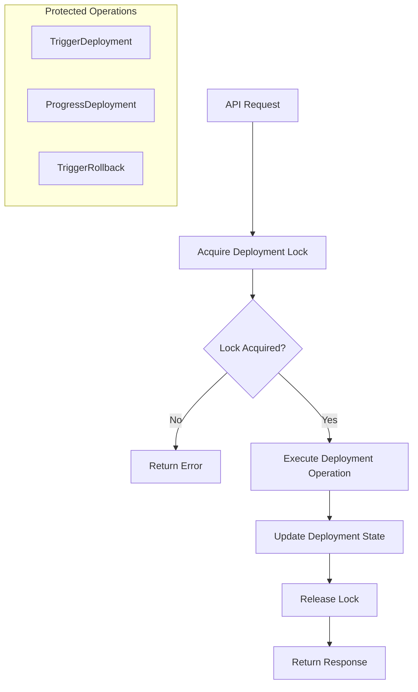
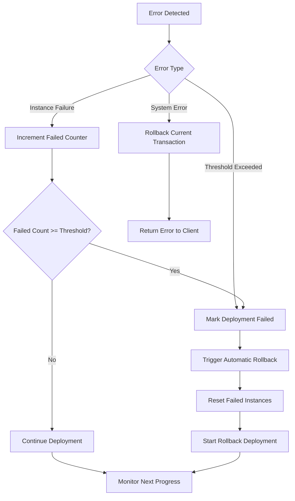

# DIDES Application State Machine Diagram and Flow Chart

## Overview
DIDES (Distributed Instance Deployment System) is a rolling deployment orchestration system that manages the deployment of code and configuration updates across multiple instances using a state machine architecture.

## 1. Deployment State Machine (✅ IMPLEMENTED)

### Deployment States

### Deployment State Definitions
- **Unknown**: Initial state when deployment record is created (iota = 0)
- **Running**: Deployment is actively progressing through instances (iota = 1) 
- **Completed**: All instances successfully updated to desired state (iota = 2)
- **Failed**: Deployment failed due to threshold exceeded or errors (iota = 3)

## 2. Instance State Machine (⚠️ PARTIALLY IMPLEMENTED)

### Instance Status States (Actual Implementation)

**⚠️ MISSING IMPLEMENTATION**: The `DEGRADED` status is documented in the README and diagrams but **NOT IMPLEMENTED** in the code. Only three statuses exist:
- `UNKNOWN` (iota = 0) - Default when instance is registered/not used
- `HEALTHY` (iota = 1) - Instance is functioning normally
- `FAILED` (iota = 2) - Instance has failed ⚠️ **Note: No DEGRADED status in code**

### Instance Update States (✅ IMPLEMENTED)

**Implementation Details**:
- `needsUpdate()`: Checks if `currentState != desiredState` (code or config version)
- `isInProgress()`: Instance has `desiredState` set but `currentState` hasn't caught up yet
- `isCompleted()`: `currentState == desiredState` AND `status == HEALTHY`
- `isFailed()`: Instance has `desiredState` set but `status == FAILED`

## 3. Rolling Deployment Flow Chart (✅ IMPLEMENTED)

### Main Deployment Flow

### Progress Deployment Flow (✅ IMPLEMENTED)

### Rollback Flow (✅ IMPLEMENTED)

## 4. Instance Update Lifecycle (✅ IMPLEMENTED)

### Instance Registration and Update Flow

**Implementation Note**: The actual heartbeat mechanism is implemented via PATCH `/inventory/instances/{instanceID}` endpoint which updates the instance's current state and status.

## 5. Concurrency and Locking (✅ IMPLEMENTED)

### Lock Management Flow

**Implementation**: Uses simple in-memory locking with key "deployment" to ensure only one deployment operation can run at a time.

## 6. State Transition Conditions (✅ IMPLEMENTED)

### Instance State Logic (Updated to Match Implementation)
| Current State | Desired State | Instance Status | Result State |
|---------------|---------------|-----------------|--------------|
| v1.0.0 | v1.0.0 | Any | Not Needing Update |
| v1.0.0 | v2.0.0 | UNKNOWN/HEALTHY | Needing Update |
| v1.0.0 | v2.0.0 | FAILED | Needing Update |
| v1.0.0 (desired: v2.0.0) | v2.0.0 | HEALTHY | In Progress → Completed |
| v1.0.0 (desired: v2.0.0) | v2.0.0 | FAILED | In Progress → Failed |

⚠️ **Note**: Original documentation mentioned DEGRADED status, but this is **not implemented** in the code.

### Deployment State Logic (✅ IMPLEMENTED)
| Current Status | Condition | Next Status | Action |
|----------------|-----------|-------------|---------|
| Running | All instances completed | Completed | Mark deployment successful |
| Running | Failed instances >= threshold | Failed | Trigger automatic rollback |
| Running | Batch in progress | Running | Wait for current batch |
| Running | Batch has capacity | Running | Start next batch |
| Failed | Rollback triggered | Running | Start rollback deployment |

## 7. Error Handling States (✅ IMPLEMENTED)

### Error Conditions and Recovery

**Implementation Details**:
- `ErrFailureThresholdExceeded` is returned when failed instances >= threshold
- Automatic rollback is triggered in `ProgressDeployment()` when this error occurs
- `ResetFailedInstances()` sets all FAILED instances matching labels back to UNKNOWN

## 8. HTTP API Endpoints (✅ IMPLEMENTED)

### Inventory Management
- `GET /inventory/instances` - List all instances
- `POST /inventory/instances/register` - Register new instance
- `PATCH /inventory/instances/{instanceID}` - Update instance status/state

### Deployment Management  
- `POST /deploy/` - Trigger deployment
- `GET /deploy/status` - Get running deployments status
- `POST /deploy/progress` - Manually progress deployment (for testing)
- `POST /deploy/rollback` - Trigger rollback

## 9. Improvements and Recommendations

### High Priority Enhancements:
1. **Database Storage**: Replace in-memory storage with persistent database

### Medium Priority Improvements:
1. **Background Processing**: Implement actual background reconciliation instead of manual progress calls
2. **Metrics and Monitoring**: Add deployment metrics and health monitoring
3. **Configuration Validation**: Enhance validation for deployment requests and instance registration

### Low Priority Enhancements:
1. **Implement DEGRADED Status**: Add the missing status constant and update state transitions
2. **Complete CLI Tool**: Implement actual CLI commands for deployment operations
3. **Complete Simulator**: Implement actual instance simulation functionality
2. **Advanced Deployment Strategies**: Implement blue-green, canary deployments

