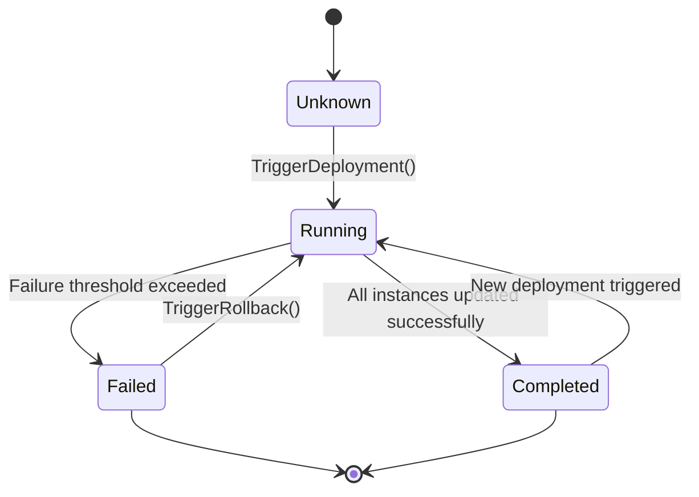
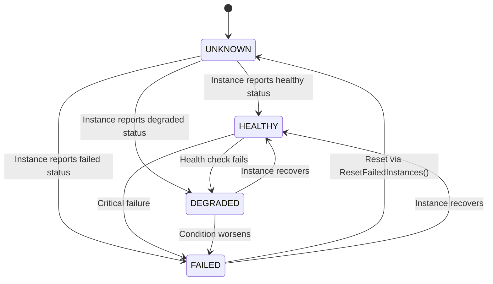
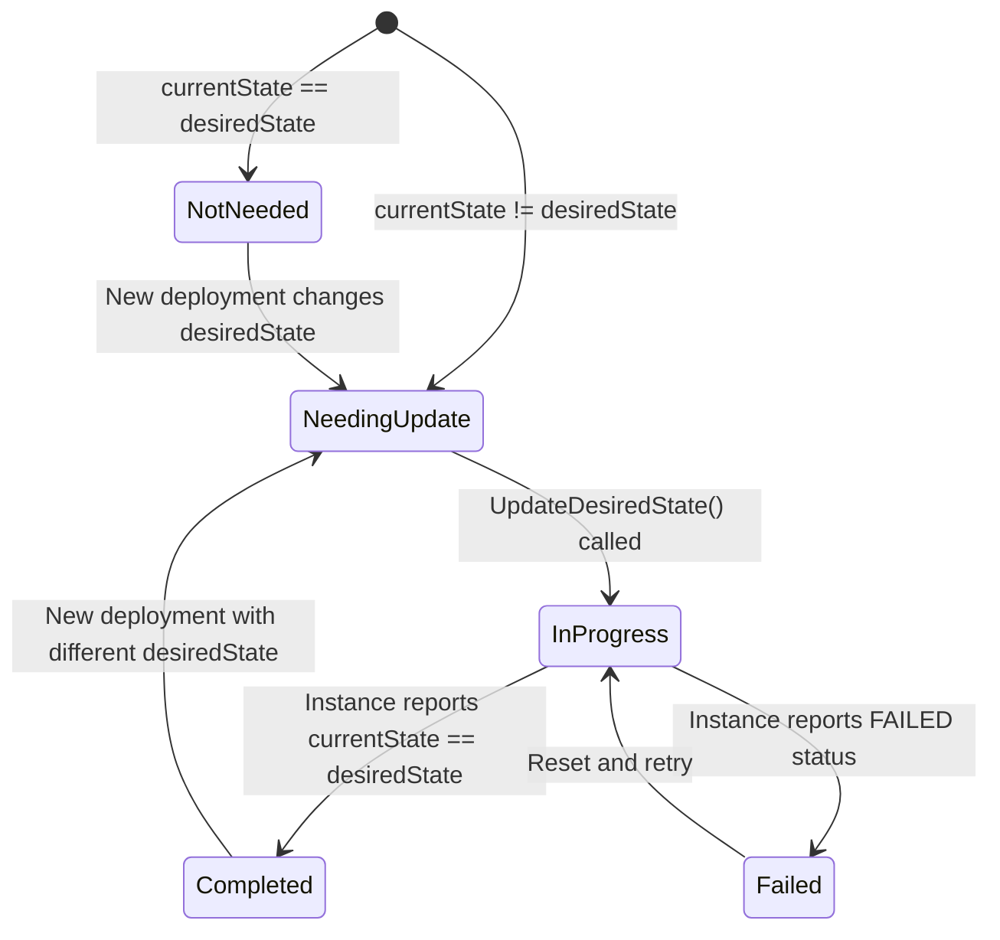
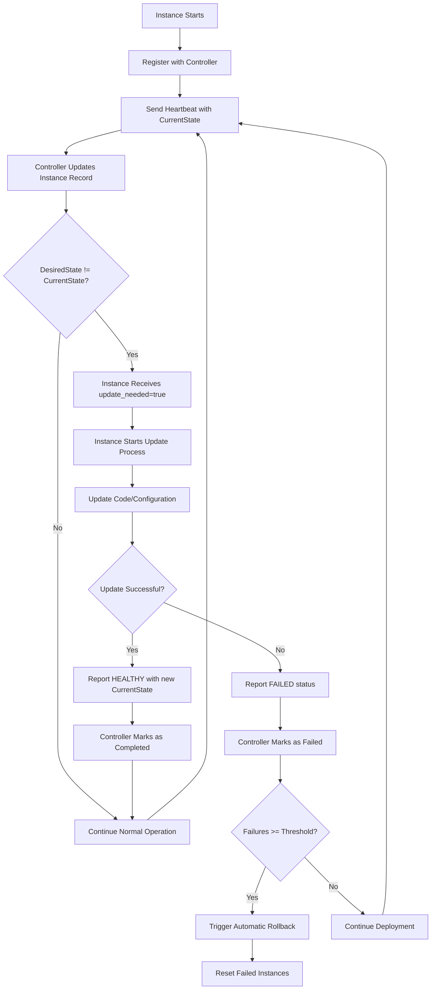
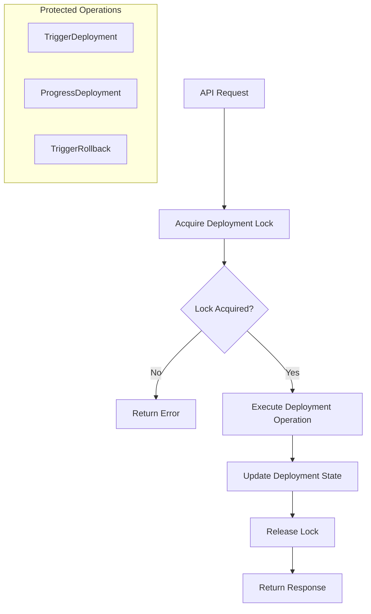
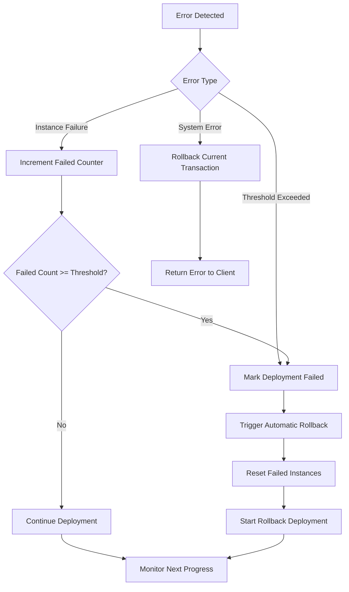

# DIDES Application State Machine Diagram and Flow Chart

## Overview
DIDES (Distributed Instance Deployment System) is a rolling deployment orchestration system that manages the deployment of code and configuration updates across multiple instances using a state machine architecture.

## 1. Deployment State Machine

### Deployment States



### Deployment State Definitions
- **Unknown**: Initial state when deployment record is created
- **Running**: Deployment is actively progressing through instances
- **Completed**: All instances successfully updated to desired state
- **Failed**: Deployment failed due to threshold exceeded or errors

## 2. Instance State Machine

### Instance Status States


### Instance Update States


## 3. Rolling Deployment Flow Chart

### Main Deployment Flow
```mermaid
flowchart TD
    A[TriggerDeployment Request] --> B{Validate Request}
    B -->|Invalid| C[Return Error]
    B -->|Valid| D{Check if Rollout in Progress}
    D -->|Yes| E[Return ErrRolloutInProgress]
    D -->|No| F[Acquire Lock]
    F --> G[Save Deployment Record with Status=Running]
    G --> H[StartDeployment()]
    
    H --> I[Calculate Total Instances Needing Update]
    I --> J{Any Instances Need Update?}
    J -->|No| K[Mark as Completed]
    J -->|Yes| L[Get First Batch of Instances]
    L --> M[Update DesiredState for Batch]
    M --> N[Update Progress: InProgressInstances++]
    N --> O[Release Lock]
    
    K --> P[End: Deployment Completed]
    O --> Q[End: Deployment Started]
```

### Progress Deployment Flow
```mermaid
flowchart TD
    A[ProgressDeployment Request] --> B[Acquire Lock]
    B --> C[Get Running Deployment]
    C --> D{Deployment Exists?}
    D -->|No| E[Return nil]
    D -->|Yes| F[Count Failed Instances]
    F --> G[Count Completed Instances]
    G --> H[Count InProgress Instances]
    H --> I[Update Progress Counters]
    
    I --> J{Failed >= FailureThreshold?}
    J -->|Yes| K[Mark as Failed]
    K --> L[Trigger Automatic Rollback]
    L --> M[Return with Rollback]
    
    J -->|No| N{All Instances Completed?}
    N -->|Yes| O[Mark as Completed]
    O --> P[End: Deployment Completed]
    
    N -->|No| Q{Batch Full (InProgress == BatchSize)?}
    Q -->|Yes| R[Wait - No New Instances]
    R --> S[Update Record & Release Lock]
    
    Q -->|No| T[Calculate Available Batch Slots]
    T --> U[Get Next Batch of Instances]
    U --> V[Update DesiredState for New Instances]
    V --> W[Update Progress: InProgressInstances++]
    W --> S
    
    S --> X[End: Progress Updated]
```

### Rollback Flow
```mermaid
flowchart TD
    A[TriggerRollback Request] --> B[Acquire Lock]
    B --> C{Running Deployment Exists?}
    C -->|Yes| D[Cancel Running Deployment]
    D --> E[Mark as Failed]
    E --> F[Reset Failed Instances to UNKNOWN]
    
    C -->|No| F
    F --> G[Find Previous Completed Deployment]
    G --> H{Previous Deployment Found?}
    H -->|No| I[Return ErrNoPreviousDeploymentFound]
    H -->|Yes| J[Create Rollback Request]
    J --> K[Save New Deployment Record]
    K --> L[StartDeployment() with Previous Versions]
    L --> M[Release Lock]
    M --> N[End: Rollback Started]
```

## 4. Instance Update Lifecycle

### Instance Registration and Update Flow


## 5. Concurrency and Locking

### Lock Management Flow


## 6. State Transition Conditions

### Instance State Logic
| Current State | Desired State | Instance Status | Result State |
|---------------|---------------|-----------------|--------------|
| v1.0.0 | v1.0.0 | Any | Not Needing Update |
| v1.0.0 | v2.0.0 | UNKNOWN/HEALTHY | Needing Update |
| v1.0.0 | v2.0.0 | DEGRADED/FAILED | Needing Update |
| v1.0.0 (desired: v2.0.0) | v2.0.0 | HEALTHY | In Progress → Completed |
| v1.0.0 (desired: v2.0.0) | v2.0.0 | FAILED | In Progress → Failed |

### Deployment State Logic
| Current Status | Condition | Next Status | Action |
|----------------|-----------|-------------|---------|
| Running | All instances completed | Completed | Mark deployment successful |
| Running | Failed instances >= threshold | Failed | Trigger automatic rollback |
| Running | Batch in progress | Running | Wait for current batch |
| Running | Batch has capacity | Running | Start next batch |
| Failed | Rollback triggered | Running | Start rollback deployment |

## 7. Error Handling States

### Error Conditions and Recovery


This state machine architecture provides:
1. **Clear state transitions** for both deployments and instances
2. **Concurrency control** through locking mechanisms
3. **Error handling and recovery** through automatic rollbacks
4. **Progress tracking** through detailed counters
5. **Batch processing** to control deployment velocity
6. **Rollback capabilities** for failed deployments

The system ensures that only one deployment can run at a time, provides detailed progress tracking, and automatically handles failures through rollback mechanisms.
