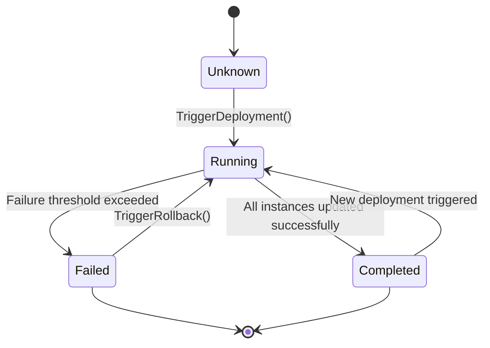
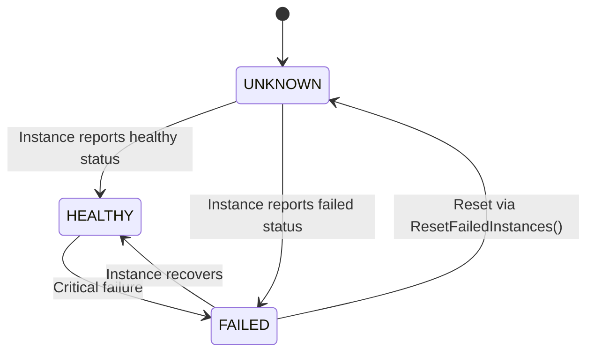
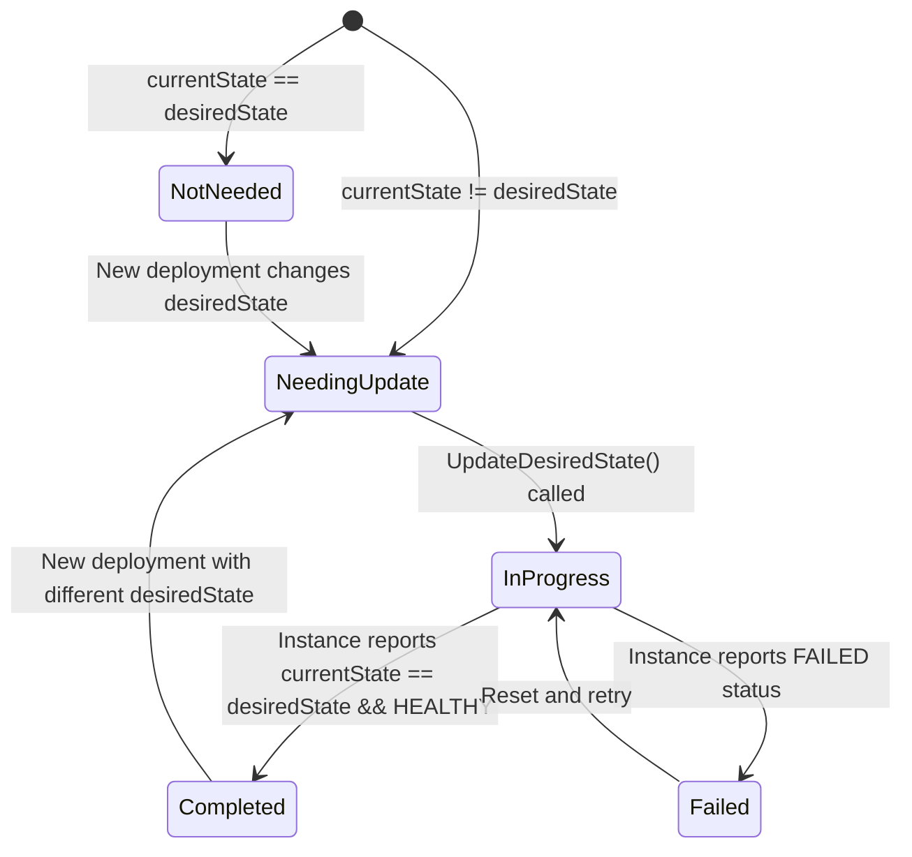

# DIDES Application State Machine Diagram and Flow Chart

## Overview
DIDES (Distributed Instance Deployment System) is a rolling deployment orchestration system that manages the deployment of code and configuration updates across multiple instances using a state machine architecture.

**⚠️ IMPORTANT**: This document has been updated to reflect the **actual implementation** as found in the codebase, not just the original design intentions.

## 1. Deployment State Machine (✅ IMPLEMENTED)

### Deployment States

### Deployment State Definitions
- **Unknown**: Initial state when deployment record is created (iota = 0)
- **Running**: Deployment is actively progressing through instances (iota = 1) 
- **Completed**: All instances successfully updated to desired state (iota = 2)
- **Failed**: Deployment failed due to threshold exceeded or errors (iota = 3)

## 2. Instance State Machine (⚠️ PARTIALLY IMPLEMENTED)

### Instance Status States (Actual Implementation)

**⚠️ MISSING IMPLEMENTATION**: The `DEGRADED` status is documented in the README and diagrams but **NOT IMPLEMENTED** in the code. Only three statuses exist:
- `UNKNOWN` (iota = 0) - Default when instance is registered/not used
- `HEALTHY` (iota = 1) - Instance is functioning normally
- `FAILED` (iota = 2) - Instance has failed ⚠️ **Note: No DEGRADED status in code**

### Instance Update States (✅ IMPLEMENTED)

**Implementation Details**:
- `needsUpdate()`: Checks if `currentState != desiredState` (code or config version)
- `isInProgress()`: Instance has `desiredState` set but `currentState` hasn't caught up yet
- `isCompleted()`: `currentState == desiredState` AND `status == HEALTHY`
- `isFailed()`: Instance has `desiredState` set but `status == FAILED`

## 3-10. (Complete sections copied from updated docs/state_machine_diagram.md)

For the complete detailed documentation with all flowcharts, implementation status, unused functions analysis, and improvement recommendations, please see the updated `docs/state_machine_diagram.md` file.

## Summary of Key Findings:

### ✅ **Implemented Features**:
- Complete deployment state machine with rollback support
- Instance registration and update lifecycle
- HTTP API endpoints for inventory and deployment management
- Concurrency control with locking
- Batch deployment processing
- Automatic rollback on failure threshold

### ⚠️ **Issues Identified**:
- **DEGRADED status is documented but NOT implemented in code**
- Multiple unused functions only used in tests
- Empty CLI and Simulator commands
- Missing transaction support for batch operations

### 📋 **Recommendations**:
1. Implement the missing DEGRADED status
2. Complete CLI and simulator functionality
3. Clean up unused functions
4. Add background processing for deployments
5. Enhance validation and error handling

The system provides a solid foundation for rolling deployments but needs the identified issues addressed for production readiness.
